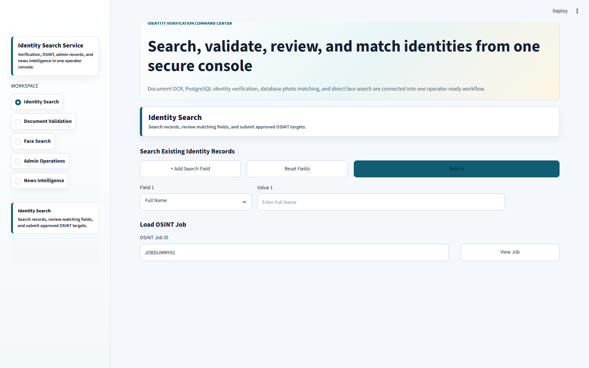
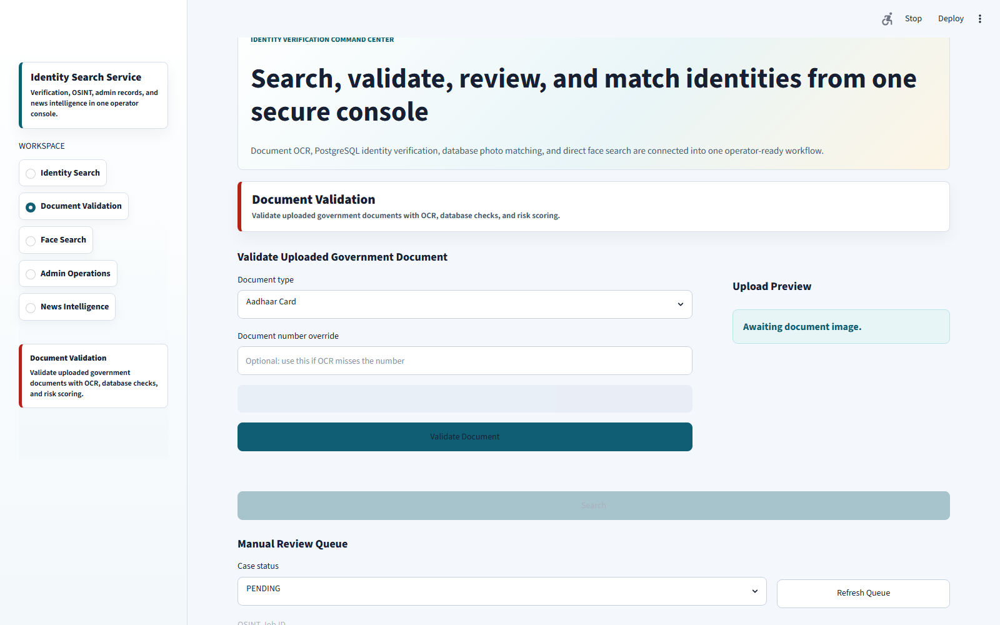
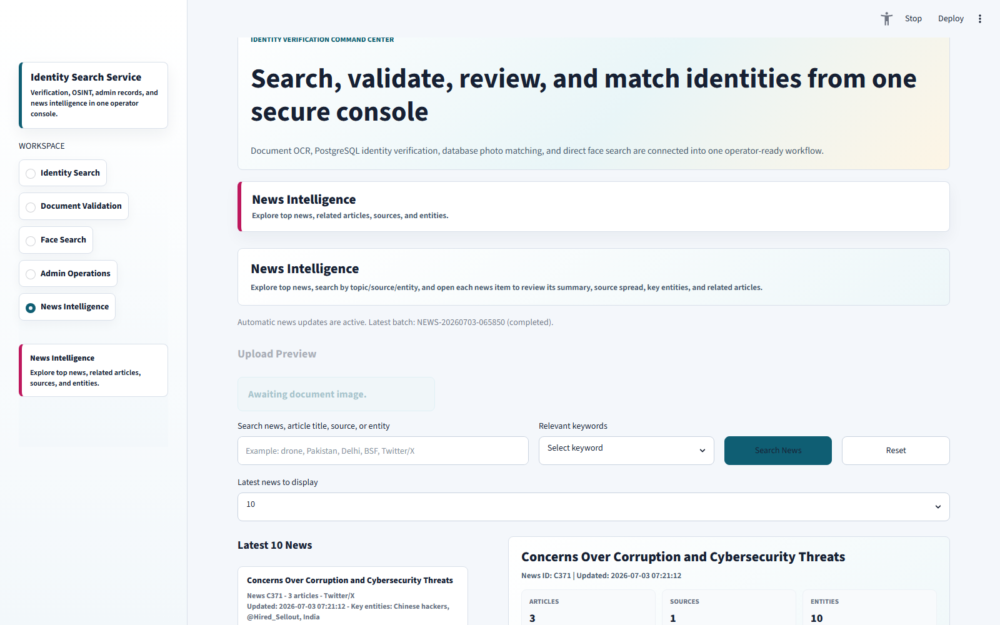

# Digital Identity Verification and Cyber Threat Monitoring System

An integrated investigation system for identity search, Indian government ID
verification, face matching, OSINT enrichment, and news intelligence. The
application combines a Streamlit operator console, a FastAPI service layer,
PostgreSQL persistence, document AI, an isolated InsightFace engine, and
authenticated external-system webhooks.

## Contents

- [System Overview](#system-overview)
- [Application Screens](#application-screens)
- [Key Capabilities](#key-capabilities)
- [Architecture](#architecture)
- [Service Workflows](#service-workflows)
- [Technology Stack](#technology-stack)
- [Repository Structure](#repository-structure)
- [Data Model](#data-model)
- [Local Setup](#local-setup)
- [Running the System](#running-the-system)
- [API Reference](#api-reference)
- [Webhook Contracts](#webhook-contracts)
- [Observability and Failure Handling](#observability-and-failure-handling)
- [Security Considerations](#security-considerations)
- [Production Readiness](#production-readiness)
- [Troubleshooting](#troubleshooting)
- [Additional Documentation](#additional-documentation)

## System Overview

The system gives an operator one console for:

- searching structured identity records by one or more attributes;
- validating Aadhaar, PAN, voter ID, driving licence, and passport images;
- comparing uploaded or OSINT-sourced faces with registered identities;
- reviewing medium-risk document cases and correcting selected fields;
- sending approved identity targets to an external OSINT engine;
- normalizing social, phone, email, and enriched OSINT results;
- browsing current news clusters, entities, sources, and related articles; and
- administering identity records while keeping face embeddings synchronized.

The primary engineering goal is to reduce manual identity investigation work
without hiding uncertainty. Automated decisions retain evidence, risk checks,
job state, error details, and manual-review paths.

## Application Screens

### Identity Search and OSINT Submission



### Document Validation and Manual Review



### News Intelligence



## Key Capabilities

| Capability | Implementation |
| --- | --- |
| Multi-field identity search | Dynamic fields, strict input validation, matched-field explanations, paginated tabular results |
| Government ID verification | Document classification, YOLO region detection, PaddleOCR extraction, normalized identity fields |
| Wrong-document rejection | Compares the selected document type with model and content-based classification before verification |
| Database verification | Exact and controlled fuzzy matching against the PostgreSQL identity dataset |
| Risk scoring | Weighted document number, DOB, name, face, and format checks with reviewer-readable flags |
| Face search | InsightFace ArcFace embeddings with PostgreSQL persistence and OpenCV fallback |
| Asynchronous operations | Persisted document and face jobs with progress, terminal status, and stale-job handling |
| OSINT integration | User-approved key/value targets, authenticated submission, webhook completion, normalized results |
| Avatar investigation | Base64/avatar decoding, profile deduplication, operator approval, database face comparison |
| News intelligence | External Docker PostgreSQL queries, webhook batch receipts, automatic dashboard refresh |
| Administration | Identity list, create, update, delete, photo management, and embedding synchronization |
| Observability | Central console and rotating-file logs plus API, DB, OSINT, and news health endpoints |

## Architecture

```mermaid
flowchart TB
    Operator["Operator / Investigator"]

    subgraph Frontend["Operator Layer"]
        Dashboard["Streamlit Dashboard"]
        Pollers["Job and News Monitors<br/>10 second refresh"]
    end

    subgraph API["Application Layer"]
        FastAPI["FastAPI Routes"]
        Validation["Input and Webhook Validation"]
        Jobs["Persisted Background Jobs"]
    end

    subgraph Core["Domain Services"]
        Identity["Identity and Admin Service"]
        Document["Document Verification Orchestrator"]
        OCR["OCR and Document Classification"]
        Face["Face Verification Service"]
        Risk["Risk Scoring and Decision"]
        OSINT["OSINT Client and Normalizer"]
        News["News Database Service"]
        Files["File Storage Service"]
    end

    subgraph MainData["Primary PostgreSQL"]
        IdentityDB[("demodataset")]
        JobDB[("face, document, and OSINT jobs")]
        ReviewDB[("manual review cases")]
        OSINTDB[("normalized OSINT tables")]
        EmbeddingDB[("identity face embeddings")]
        NewsEvents[("news ingestion events")]
    end

    subgraph Models["AI and Model Services"]
        IDValidator["Vendored Indian ID Validator<br/>YOLO and PaddleOCR"]
        FaceEngine["Isolated InsightFace Engine<br/>ArcFace / buffalo_l"]
        OpenCV["OpenCV Fallback"]
    end

    subgraph External["External Intelligence Systems"]
        OSINTEngine["OSINT Engine"]
        NewsEngine["News Scraper"]
        NewsPostgres[("External Docker PostgreSQL")]
    end

    subgraph Runtime["Runtime Assets"]
        Uploads[("Uploaded documents and faces")]
        Logs[("Central rotating logs")]
    end

    Operator --> Dashboard
    Dashboard --> FastAPI
    Pollers --> FastAPI
    FastAPI --> Validation
    Validation --> Jobs
    Validation --> Identity
    Validation --> Document
    Validation --> OSINT
    Validation --> News

    Document --> Files
    Document --> OCR
    Document --> Identity
    Document --> Face
    Document --> Risk

    OCR --> IDValidator
    Face --> FaceEngine
    Face -. fallback .-> OpenCV

    Identity --> IdentityDB
    Jobs --> JobDB
    Document --> ReviewDB
    OSINT --> OSINTDB
    Face --> EmbeddingDB
    News --> NewsEvents
    Files --> Uploads

    OSINT -->|"POST scan"| OSINTEngine
    OSINTEngine -->|"authenticated result webhook"| FastAPI
    NewsEngine -->|"writes completed batch"| NewsPostgres
    NewsEngine -->|"authenticated update webhook"| FastAPI
    News --> NewsPostgres

    FastAPI --> Logs
    Document --> Logs
    OSINT --> Logs
    News --> Logs

    classDef ui fill:#e8f5f7,stroke:#0f5e73,color:#172033,stroke-width:2px;
    classDef api fill:#eff6ff,stroke:#2563eb,color:#172033,stroke-width:2px;
    classDef service fill:#fff7ed,stroke:#ea580c,color:#172033,stroke-width:2px;
    classDef data fill:#ecfdf3,stroke:#087443,color:#172033,stroke-width:2px;
    classDef model fill:#fdf2f8,stroke:#be185d,color:#172033,stroke-width:2px;
    classDef external fill:#fff0ee,stroke:#b42318,color:#172033,stroke-width:2px;

    class Dashboard,Pollers ui;
    class FastAPI,Validation,Jobs api;
    class Identity,Document,OCR,Face,Risk,OSINT,News,Files service;
    class IdentityDB,JobDB,ReviewDB,OSINTDB,EmbeddingDB,NewsEvents,NewsPostgres,Uploads,Logs data;
    class IDValidator,FaceEngine,OpenCV model;
    class OSINTEngine,NewsEngine external;
```



## Service Workflows

### 1. Identity Search

1. The operator adds one or more fields such as name, username, phone, email,
   government ID, employee ID, department, state, or face image.
2. The dashboard validates each field before submission.
3. FastAPI sends text criteria to `DatabaseService.search_identity_multi`.
4. PostgreSQL returns records matching the submitted criteria and identifies
   which fields caused each result to match.
5. Results are retained in Streamlit session state and rendered as a paginated
   table.
6. Eligible fields can be reviewed, removed, or approved before OSINT
   submission. Username and face targets are supported without weakening
   database validation.

### 2. Document Validation

1. FastAPI creates a persistent document job and immediately returns its job ID.
2. `FileService` validates and stores the uploaded image.
3. `OCRService` invokes the vendored Indian ID validator in a subprocess.
4. The classifier checks whether the uploaded document matches the selected ID
   type. A mismatch stops the workflow before database verification.
5. YOLO detects document regions and PaddleOCR extracts text.
6. Extracted values are normalized into the common identity schema.
7. `DatabaseService` performs exact document matching and controlled Aadhaar OCR
   correction.
8. The extracted document face is compared with the registered database photo.
9. `RiskScoringService` assigns a 0-100 score from document, DOB, name, face,
   and format evidence.
10. `DecisionService` returns `VERIFIED`, `MANUAL REVIEW`, or `NOT VERIFIED`.
11. Medium-risk cases are persisted for operator review and selected-field
   correction.

### 3. Face Search

1. The uploaded image is saved and a persistent face-search job is created.
2. The backend checks whether every registered photo has a current stored
   embedding.
3. If coverage is complete, one query embedding is compared with PostgreSQL
   `REAL[]` embeddings using cosine similarity.
4. Threshold, second-best score, and minimum-score-gap rules reduce ambiguous
   auto-matches.
5. If the isolated face engine or embedding index is unavailable, the service
   can use its OpenCV comparison path.
6. The job stores progress, the best candidate, evidence paths, final status,
   and any failure reason.

The InsightFace environment is intentionally isolated from the main environment
to prevent dependency conflicts with PaddleOCR and the Indian ID validator.

### 4. OSINT Investigation

1. The operator reviews exactly which identity values and face image may leave
   the system.
2. The backend allocates a single readable ID such as `JOB00001` and persists
   the job before contacting the provider.
3. `OSINTService` performs a TCP preflight, sends key/value targets with an API
   key, and validates the provider's immediate response.
4. The external engine processes the request asynchronously and posts the final
   payload to the authenticated callback.
5. The webhook validates the token and job ID, stores the raw result, and marks
   the job terminal.
6. `OSINTNormalizerService` separates social profiles, phone/email contacts,
   enriched matches, avatar references, and identity links into relational
   tables.
7. Base64 avatars are decoded into job-scoped files. Invalid, duplicate, or
   broken image candidates are excluded from face-review cards.
8. Approved avatars can be compared with the identity database to produce a
   combined DB plus OSINT profile summary.

### 5. News Intelligence

1. The external news engine scrapes and commits clusters, articles, and entity
   relationships to its Docker PostgreSQL database.
2. When a batch completes or fails, it sends an authenticated webhook containing
   `batch_id`, terminal status, completion time, and row counts.
3. FastAPI stores the idempotent receipt in `news_ingestion_events`.
4. `NewsDatabaseService` reads the external database through
   `NEWS_DATABASE_URL` without mixing news data into the identity database.
5. The dashboard lists the latest 10, 20, 30, 40, or 50 news clusters and lets
   operators search titles, sources, content, and entities.
6. A Streamlit monitor compares the latest webhook receipt and live database
   snapshot every 10 seconds. New data clears stale news caches and refreshes
   the latest view automatically.
7. If the external database is temporarily unavailable, the webhook receipt
   remains visible and the API reports the snapshot failure separately.

### 6. Admin and Manual Review

- Admin routes support listing, loading, creating, updating, and deleting
  identities.
- Photo changes trigger an InsightFace embedding synchronization task.
- Identity deletion also removes its persisted embedding.
- Manual-review decisions and reviewer-approved field changes are persisted in
  PostgreSQL for auditability.

## Technology Stack

| Layer | Tools |
| --- | --- |
| Language | Python 3.10 |
| Frontend | Streamlit, HTML/CSS rendered through Streamlit |
| API | FastAPI, Uvicorn, multipart form handling |
| Primary data store | PostgreSQL through `psycopg2` |
| External news store | Docker PostgreSQL through a separate DSN |
| Document AI | Ultralytics YOLO, PaddleOCR, PaddlePaddle |
| Face AI | InsightFace, ONNX Runtime, ArcFace `buffalo_l` |
| Image processing | OpenCV, Pillow, NumPy |
| Matching and decisions | Exact/fuzzy normalization, cosine similarity, weighted rules |
| Integrations | REST APIs, API-key authentication, authenticated webhooks |
| Operations | Central Python logging, rotating log files, health endpoints |

## Repository Structure

```text
identity-search-service/
|-- backend/
|   |-- api/
|   |   `-- routes.py                 # FastAPI endpoints and job orchestration
|   |-- migrations/                   # PostgreSQL schema migrations and test seeds
|   |-- services/
|   |   |-- database_service.py       # Primary SQL and persistence layer
|   |   |-- document_verification_service.py
|   |   |-- face_service.py
|   |   |-- file_service.py
|   |   |-- news_database_service.py
|   |   |-- ocr_service.py
|   |   |-- osint_normalizer_service.py
|   |   |-- osint_service.py
|   |   |-- risk_service.py
|   |   `-- decision_service.py
|   |-- vendor/indian-id-validator/   # Vendored document AI implementation
|   |-- app.py                        # FastAPI entry point
|   `-- config.py                     # Environment-backed runtime settings
|-- face_engine/
|   |-- app.py                        # Isolated face API
|   |-- engine.py                     # InsightFace embedding and search logic
|   `-- requirements-face.txt
|-- frontend/
|   `-- dashboard.py                  # Streamlit operator console
|-- scripts/
|   `-- backfill_face_embeddings.py
|-- utils/
|   `-- logger.py                     # Central console and rotating-file logger
|-- docs/
|   |-- assets/                       # README screenshots
|   `-- *.md                          # Integration and architecture documents
|-- .env.example
|-- requirements.txt
`-- README.md
```

## Data Model

### Primary identity database: `excel_import`

| Table | Purpose |
| --- | --- |
| `demodataset` | Identity master records and registered photo paths |
| `identity_face_embeddings` | Normalized InsightFace vectors, model metadata, and photo hashes |
| `face_search_jobs` | Face-search progress, terminal state, result, and errors |
| `document_validation_jobs` | Document progress, inputs, decision payload, and errors |
| `manual_review_cases` | Evidence and reviewer decisions for uncertain document checks |
| `osint_jobs` | Stable job ID, targets, provider response, raw result, and status |
| `osint_profiles` | Normalized social profiles and avatar references |
| `osint_contacts` | Normalized phone and email intelligence |
| `osint_matches` | Enriched OSINT matches |
| `osint_identity_links` | Links between OSINT evidence and registered identities |
| `news_ingestion_events` | Idempotent news webhook receipts and DB snapshots |

### External news database

| Table | Purpose |
| --- | --- |
| `clusters` | News groups, summaries, counts, and update timestamps |
| `articles` | Source articles and published content |
| `cluster_entities` | Entities associated with each cluster |
| `article_entities` | Entities associated with each article |

## Local Setup

### Prerequisites

- Windows 10/11 or an equivalent environment with command adjustments
- Python 3.10
- PostgreSQL
- Git
- Approximately 3 GB or more free disk space for Python packages and models
- Network access to OSINT/news systems when those integrations are enabled

### 1. Clone and create the main environment

```powershell
git clone https://github.com/Devenpj/identity-search-service.git
cd identity-search-service

py -3.10 -m venv .venv
Set-ExecutionPolicy -Scope Process -ExecutionPolicy RemoteSigned
.\.venv\Scripts\Activate.ps1
python -m pip install --upgrade pip
pip install -r requirements.txt
```

`requirements.txt` also installs the vendored Indian ID validator dependencies.
Model weights under `backend/vendor/indian-id-validator/models/` are intentionally
excluded from Git and must be provisioned separately.

### 2. Configure environment values

```powershell
Copy-Item .env.example .env
```

Edit `.env` with real values. Never commit `.env`.

| Variable | Purpose |
| --- | --- |
| `OSINT_API_BASE_URL` | External OSINT engine base URL |
| `OSINT_API_KEY` | API key sent as `X-API-Key` |
| `OSINT_CALLBACK_URL` | Public/LAN callback endpoint for OSINT results |
| `OSINT_WEBHOOK_TOKEN` | Secret accepted from the OSINT callback |
| `OSINT_JOB_STALE_MINUTES` | Maximum non-terminal OSINT age |
| `NEWS_DATABASE_URL` | Separate PostgreSQL DSN for news intelligence |
| `NEWS_WEBHOOK_TOKEN` | Secret accepted as `X-News-Webhook-Secret` |
| `NEWS_WEBHOOK_PATH` | Configurable news webhook path |
| `FACE_ENGINE_URL` | Isolated InsightFace service URL |
| `FACE_ENGINE_TIMEOUT_SECONDS` | Main backend to face-engine timeout |
| `FACE_ENGINE_MATCH_THRESHOLD` | Minimum ArcFace similarity |
| `FACE_ENGINE_MIN_SCORE_GAP` | Required gap between best and second candidate |
| `FACE_EMBEDDING_MODEL` | InsightFace model name, default `buffalo_l` |

### 3. Prepare PostgreSQL

The current local `DatabaseService` expects:

```text
host=localhost
port=5432
database=excel_import
user=postgres
password=postgres
```

Create the database and ensure the populated `demodataset` identity table is
available. Runtime startup creates or migrates helper tables. SQL migration
files remain available under `backend/migrations/` for controlled deployment.

For company deployment, move the primary database credentials from
`DatabaseService` into environment-backed configuration before release.

### 4. Create the isolated face environment

Open a second terminal:

```powershell
cd face_engine
py -3.10 -m venv .venv-face
.\.venv-face\Scripts\Activate.ps1
python -m pip install --upgrade pip
pip install -r requirements-face.txt
```

InsightFace downloads `buffalo_l` on first use if it is not already available
under the user model directory.

### 5. Backfill persistent face embeddings

Start the face engine first, then run from the project root:

```powershell
.\.venv\Scripts\Activate.ps1
python scripts\backfill_face_embeddings.py
```

Run this after initially loading identities or after bulk photo changes.

## Running the System

Use three visible terminals.

### Terminal 1: InsightFace engine

```powershell
cd face_engine
.\.venv-face\Scripts\Activate.ps1
python -m uvicorn app:app --host 127.0.0.1 --port 8010
```

### Terminal 2: FastAPI backend

```powershell
cd C:\path\to\identity-search-service
.\.venv\Scripts\Activate.ps1
python -m uvicorn backend.app:app --host 0.0.0.0 --port 8000 --reload
```

### Terminal 3: Streamlit dashboard

```powershell
cd C:\path\to\identity-search-service
.\.venv\Scripts\Activate.ps1
python -m streamlit run frontend\dashboard.py --server.port 8501
```

### Local URLs

| Component | URL |
| --- | --- |
| Dashboard | `http://127.0.0.1:8501` |
| API root | `http://127.0.0.1:8000` |
| Swagger UI | `http://127.0.0.1:8000/docs` |
| Face health | `http://127.0.0.1:8010/health` |

To expose FastAPI on the same LAN, keep `--host 0.0.0.0` and use the host
machine's IPv4 address, for example `http://HOST_IP:8000/docs`. Configure
the Windows Firewall rule narrowly for the required network and port.

## API Reference

### Health

| Method | Path | Purpose |
| --- | --- | --- |
| `GET` | `/health` | API process health |
| `GET` | `/health/db` | Primary PostgreSQL health |
| `GET` | `/health/osint?check_network=true` | OSINT configuration and optional reachability |
| `GET` | `/health/news-db` | External news database health |
| `GET` | `/health/full` | Combined dependency health |

### Identity and verification

| Method | Path | Purpose |
| --- | --- | --- |
| `POST` | `/search-identity` | Search one field |
| `POST` | `/search-identity-advanced` | Search multiple criteria |
| `POST` | `/api/v1/jobs/document-validation` | Create a document job |
| `GET` | `/api/v1/jobs/document-validation/{job_id}` | Read document progress/result |
| `POST` | `/api/v1/jobs/face-search` | Create a face-search job |
| `GET` | `/api/v1/jobs/face-search/{job_id}` | Read face progress/result |
| `GET` | `/manual-review-cases` | List review cases |
| `POST` | `/manual-review-cases/{case_id}/decision` | Approve/update a case |

### OSINT

| Method | Path | Purpose |
| --- | --- | --- |
| `POST` | `/api/v1/osint/jobs` | Create an approved OSINT job |
| `GET` | `/api/v1/osint/jobs/{job_id}` | Read stored status and result |
| `POST` | `/api/webhooks/osint-results` | Receive provider results |
| `POST` | `/api/v1/osint/jobs/{job_id}/verify-avatars` | Verify approved avatars |

### News

| Method | Path | Purpose |
| --- | --- | --- |
| `POST` | `/api/webhooks/news-updated` | Accept a terminal scraper notification |
| `GET` | `/api/v1/news/sync-status/latest` | Read latest batch and optional live snapshot |
| `GET` | `/api/v1/news/clusters/top` | Read latest news clusters |
| `GET` | `/api/v1/news/search` | Search news and entities |
| `GET` | `/api/v1/news/topics` | Read keyword suggestions |
| `GET` | `/api/v1/news/clusters/{cluster_id}` | Read full cluster detail |

### Administration

| Method | Path | Purpose |
| --- | --- | --- |
| `GET` | `/admin/identities` | Paginated identity list |
| `GET` | `/admin/identities/{employee_id}` | Load one identity |
| `POST` | `/admin/identities` | Create an identity |
| `POST` | `/admin/identities/{employee_id}/update` | Update an identity |
| `POST` | `/admin/identities/{employee_id}/delete` | Delete an identity |

## Webhook Contracts

### OSINT submission sent by this backend

```json
{
  "job_id": "JOB00001",
  "targets": [
    {"key": "username", "value": "example_user"},
    {"key": "email", "value": "person@example.com"}
  ],
  "callback_url": "http://backend-host:8000/api/webhooks/osint-results?webhook_token=SECRET"
}
```

The OSINT engine must immediately echo the same `job_id`, then include it in the
final callback.

### OSINT result callback

```json
{
  "job_id": "JOB00001",
  "status": "completed",
  "results": {
    "username_results": [],
    "instagram_results": [],
    "phone_results": [],
    "email_results": [],
    "all_matches": []
  }
}
```

Authentication may use the `X-Webhook-Secret` header or the configured
`webhook_token` query parameter.

### News update callback

```http
POST /api/webhooks/news-updated
X-News-Webhook-Secret: <NEWS_WEBHOOK_TOKEN>
Content-Type: application/json
```

```json
{
  "batch_id": "NEWS-20260702-001",
  "status": "completed",
  "completed_at": "2026-07-02T10:30:00+05:30",
  "counts": {
    "clusters": 12,
    "articles": 240,
    "cluster_entities": 90,
    "article_entities": 820
  }
}
```

Valid news statuses are `completed` and `failed`. `batch_id` is the idempotency
key, so duplicate notifications update the same receipt instead of creating
duplicate events.

## Observability and Failure Handling

- `utils/logger.py` configures one shared format for terminal and file logs.
- Logs rotate at 5 MB with five backups under
  `logs/identity_search_service.log`.
- Job creation is persisted before long-running document, face, or OSINT work.
- Progress and terminal results survive Streamlit section changes and reruns.
- Stale non-terminal jobs are marked failed after configurable age limits.
- OSINT failures distinguish DNS, TCP connection, connect timeout, read
  timeout, HTTP rejection, malformed JSON, and mismatched job ID.
- News webhook receipt health is independent from live external DB health.
- Every service closes database connections in `finally` blocks at request
  boundaries.

Useful checks:

```powershell
Invoke-RestMethod http://127.0.0.1:8000/health/full
Test-NetConnection <external-host> -Port <port>
Get-Content .\logs\identity_search_service.log -Tail 100
```

## Security Considerations

Implemented safeguards:

- secrets are loaded from `.env`, which is excluded from Git;
- external callbacks use constant-time token comparison;
- OSINT submissions require explicit operator approval;
- uploaded file extensions and image content are validated;
- OSINT face payload size is bounded;
- webhook payload size and terminal status are validated;
- SQL field selection is restricted to allowlisted identity columns;
- base64 image data is not retained in OSINT job target audit JSON;
- runtime uploads, logs, model weights, and generated evidence are ignored by
  Git.

Required before production:

- move primary DB credentials into environment or a secrets manager;
- protect dashboard and admin APIs with authentication and role-based access;
- use TLS for every machine-to-machine connection;
- prefer signed headers over query-string webhook tokens;
- restrict CORS, firewall rules, and database network exposure;
- encrypt sensitive fields and file storage at rest;
- define retention and deletion policies for ID images, faces, and OSINT data;
- add immutable audit records for admin and reviewer actions.

## Production Readiness

The current system is suitable for controlled internal deployment and
integration testing. For higher scale and stronger availability:

1. Replace in-process FastAPI background tasks with Celery/RQ workers and
   Redis/RabbitMQ.
2. Use SQLAlchemy or a PostgreSQL connection pool instead of opening one
   `psycopg2` connection per service instance.
3. Move face vectors to `pgvector` with an HNSW/IVFFlat index when identity
   volume grows beyond in-memory cosine search.
4. Add Alembic-managed schema versions instead of runtime DDL.
5. Add pytest coverage for validators, risk rules, webhook idempotency,
   normalization, and failure states.
6. Add API authentication, RBAC, rate limiting, request IDs, and structured
   JSON logs.
7. Deploy FastAPI, Streamlit, workers, PostgreSQL, and the face engine as
   independently monitored containers.
8. Add metrics and alerts for job latency, failure rate, webhook age, DB
   connectivity, OCR confidence, and face-match ambiguity.
9. Calibrate face thresholds and risk weights against a governed validation
   dataset before relying on automatic approval.

## Troubleshooting

| Symptom | Likely cause | Resolution |
| --- | --- | --- |
| `127.0.0.1 refused to connect` | Backend or Streamlit is not running | Start the relevant terminal and verify the listening port |
| `No module named backend` | Uvicorn command was run from the wrong directory | From root use `python -m uvicorn backend.app:app`; inside `backend` use `python -m uvicorn app:app` |
| `No module named insightface` | Main environment is active in `face_engine` | Activate `face_engine/.venv-face` and reinstall `requirements-face.txt` |
| Face engine read timeout | Candidate-by-candidate search or engine unavailable | Backfill embeddings, verify port 8010, and check `/health` |
| OCR returns no fields | Missing weights, incompatible OCR environment, or poor image | Verify model files, dependencies, selected document type, and upload quality |
| OSINT connect timeout | Wrong IP, provider down, firewall, or different network/VPN | Run `Test-NetConnection` from the backend machine; increasing timeout does not fix blocked TCP |
| Webhook `401` | Secret missing or different on sender and receiver | Compare `.env` token with the configured authentication header/query value |
| Webhook `422` | JSON body does not match the endpoint contract | Send the documented required fields and `Content-Type: application/json` |
| News DB unavailable | Docker port not published or firewall blocks the host port | Verify `0.0.0.0:host_port->5432/tcp`, firewall, and `NEWS_DATABASE_URL` |
| Job remains processing | Worker/process stopped before terminal update | Stale-job handling marks it failed after the configured time; inspect central logs |

## Validation Commands

```powershell
python -m py_compile `
  backend\app.py `
  backend\api\routes.py `
  backend\services\database_service.py `
  backend\services\document_verification_service.py `
  backend\services\face_service.py `
  backend\services\ocr_service.py `
  backend\services\osint_service.py `
  frontend\dashboard.py `
  face_engine\app.py `
  face_engine\engine.py
```

After startup:

```powershell
Invoke-RestMethod http://127.0.0.1:8000/health
Invoke-RestMethod http://127.0.0.1:8000/health/db
Invoke-RestMethod http://127.0.0.1:8010/health
```

## Additional Documentation

- [Client and workflow explanation](docs/Identity_Search_Service_Client_Explanation.md)
- [OSINT webhook integration](docs/OSINT_Webhook_Integration_Setup.md)
- [News Intelligence webhook integration](docs/News_Intelligence_Webhook_Setup.md)
- [Persistent face embeddings](docs/Persistent_Face_Embeddings.md)
- [Isolated face engine](face_engine/README.md)

